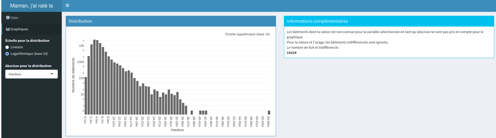
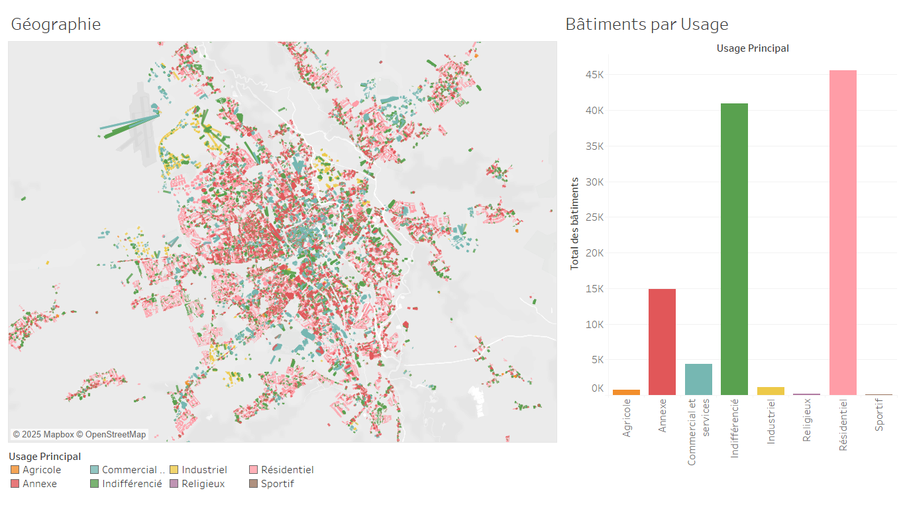
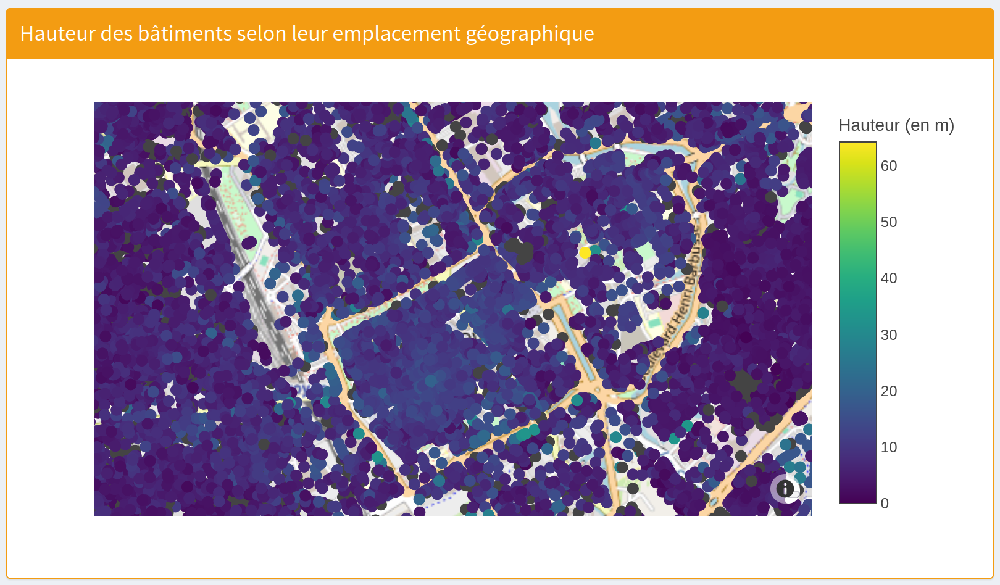
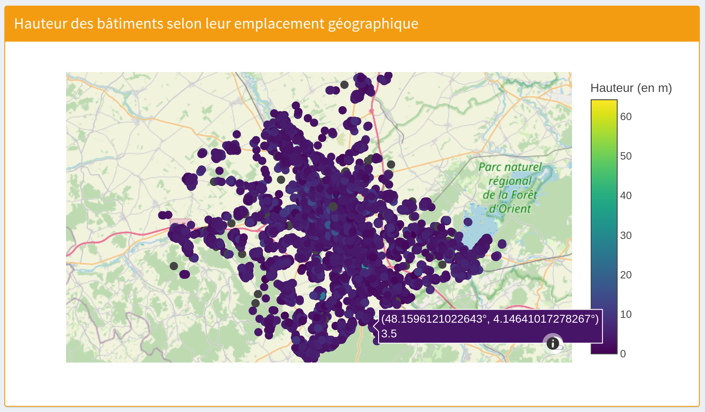

```{css, echo=FALSE}
p { text-align: justify; }
```

# Étude des bâtiments de Troyes

# Introduction

## Données

Le jeu de données « Bâtiments de Troyes Champagne Métropole » recense l’ensemble des bâtiments situés dans l’agglomération Troyes Champagne Métropole, à des fins variées telles que l’urbanisme, l’aménagement du territoire, les analyses foncières ou encore la gestion des services publics.
Il a été publié en août 2024 sur la plateforme data.gouv.fr.

Ce jeu de données provient de l’unification des bases BDTOPO® et BD PARCELLAIRE® de l’IGN.
Il comprend 107 946 observations, avec très peu de valeurs manquantes, ce qui en fait une base fiable et complète pour l’analyse spatiale.

Nous avons choisi ce jeu de données, car il nous semble pertinent d’étudier la répartition géographique des bâtiments dans la ville de Troyes.
Afin d’enrichir notre analyse, nous avons décidé d’y associer un second jeu de données : la Base Adresse Nationale (BAN), qui recense les adresses géolocalisées des bâtiments sur l’ensemble du territoire français (nous utiliserons uniquement les adresses du département nous concernant).

### Origines et format des données

La base de données bâtiments est disponible [ici](https://www.data.gouv.fr/fr/datasets/batiments-de-troyes-champagne-metropole/).
Ce jeu de données a été commandé par "Troyes Champagne Métropole" et a été mise à jour dernièrement en août 2024 dans le but de regrouper les entités géographiques de la métropole troyenne.
Les données proviennent elles-mêmes de deux sources différentes qui ont été fusionnées : BDTOPO® et BD PARCELLAIRE®, les deux étant produits par IGN.

-   La BD PARCELLAIRE® fournit l'information cadastrale numérique, géo-référencée et continue sur l'ensemble du territoire français. Elle est réalisée à partir de l'assemblage du plan cadastral dématérialisé. Cependant, elle n'est plus entretenue depuis 2019.
-   La BDTOPO® est maintenu depuis 2019, elle couvre de manière cohérente l’ensemble des entités géographiques et administratives du territoire national.

Et la base de données des adresses, un csv par département, est [ici](https://adresse.data.gouv.fr/data/ban/adresses/latest/csv) (adresses-10.csv que nous avons renommé [adresses_aube.csv](data/adresses_aube.csv)).
Les données proviennent de la BAN.
Ces données sont initialement destiné aux services d'urgence pour qu'ils puissent se diriger.
Elle est aussi destiné au raccord aux réseaux d’énergies ou de communication ou encore pour des analyses cartographiques précises.
Sa constitution est copilotée par l’ANCT, la DINUM et l’IGN.

Les liens, quant à eux sont disponibles sur ce [lien](https://geoservices.ign.fr/ban-plus).
Produits aussi par IGN, c'est une base de données qui permet de lier la BAN à son environnement géographique.

### Les variables

Dans notre étude, nous allons considérer 16 variables.

#### BATI

Nous avons sélectionné 14 variables dans le premier jeu de données.

| Nom | Type | Description |
|------------------------|------------------------|------------------------|
| NATURE | nominal | architecture du bâtiment |
| USAGE1 | nominal | utilisation du bâtiment (agricole, résidentiel, religieux...) |
| USAGE2 | nominal (optionnel) | utilisation du bâtiment |
| LEGER | discrète | structure légère ou pas |
| DATE_APP | discrète | date d'apparition/construction (pas toujours présent) |
| ACQU_PLANI | nominal | de quelle base provient l'information |
| NB_LOGTS | discrète | nombre de logements dans le bâtiment |
| NB_ETAGES | discrète | nombre d'étages du bâtiment |
| MAT_MURS | discrète | code des matériaux des murs (à croiser avec le csv [materiaux_murs.csv](data/materiaux_murs.csv)) |
| MAT_TOITS | discrète | code des matériaux de la toiture (à croiser avec le csv [materiaux_toits.csv](data/materiaux_toits.csv)) |
| HAUTEUR | continue | hauteur du bâtiment |
| Z_SOL | continue | altitude du sol |
| Z_TOIT | continue | altitude du toit |
| ETAT | nominal | état du bâtiment (en projet, en construction, en service, en ruine) |

#### ADRESSES

Pour la localisation, nous utiliserons 2 variables : la longitude et la latitude.

| Nom       | Type     | Description    |
|-----------|----------|----------------|
| LONGITUDE | continue | coordonnée GPS |
| LATITUDE  | continue | coordonnée GPS |

### Pourquoi avoir choisi ces variables

Nous avons enlevé les variables qui nous semblaient inutiles ainsi que celles comportant peu de valeurs.
Nous avons aussi enlevé les variables que nous n'avons pas trouvées pertinentes.

## Plan d'analyse

### 1. Y a-t-il une liaison entre la hauteur des bâtiments et leur usage ?

Il s'agit de déterminer s'il existe une relation entre la hauteur d'un bâtiment et son usage.
Les variables utilisées sont : la variable `hauteur` et la variable `usage1`.

Pour cela, nous envisageons d'utiliser :

-   Un diagramme à barres empilées pour étudier la répartition des usages :
    -   L'axe des abscisses représenterait les tranches de hauteur
    -   L'axe des ordonnées représenterait le nombre de bâtiments
    -   Chaque barre avec une répartition des usages

### 2. Comment la ville de Troyes s'est étendue géographiquement au fil des années ?

Il s'agit ici de visualiser l'évolution spatiale de la ville de Troyes au fil du temps.
Pour cela, nous utiliserons la variable `date_app` et les variables de coordonnées géographiques : `latitude` et `longitude`.

Comme types de visualisations à envisager, nous avons :

-   Une carte avec les bâtiments colorés selon leur date (période) de construction

Les problèmes potentiels :

-   l'absence de date de construction pour certains bâtiments

### 3. Y a-t-il un lien entre les matériaux de construction et les dates de construction ?

Il s'agit ici de déterminer s'il existe une relation entre les variables `date_app`, `mat_murs` et `mat_toits`.
L'objectif est de vérifier si les matériaux de construction des bâtiments varient en fonction des époques.

Pour cela, nous envisageons de faire deux heatmaps afin que les résultats soient les plus lisibles possibles.

Problèmes potentiels:
- le manque d'information pour les vieux bâtiments.
- la grande quantité de bâtiments construits récemment risque d'écraser le reste des données.

### 4. Y a-t-il une corrélation entre les matériaux de construction et la hauteur du bâtiment ?

L'objectif ici est de comprendre si l'évolution des matériaux a un impact sur la hauteur des bâtiments.
Nous aimerions comparer la distribution des hauteurs en fonction des matériaux et vérifier si certains matériaux sont associés à des hauteurs spécifiques.
Nous utiliserions de nouveau les variables `mat_murs` et `mat_toits` que nous mettrions en relation avec la variable `hauteur`.

Pour cela, nous envisageons d'utiliser :

-   Un violon plot ou box plot :
    -   L'axe des abscisses représentant le type de matériau
    -   L'axe des ordonnées représentant la hauteur des bâtiments

### 5. Existe-t-il une relation entre la localisation géographique et l'usage des bâtiments ?

L'objectif ici est de déterminer si certains types d'usage des bâtiments sont spécifiquement localisés dans certaines zones de la ville de Troyes.
Pouvons-nous identifier des zones résidentielles, des zones industrielles et des zones commerciales ?
Nous utiliserons les variables de coordonnées géographiques (`longitude` et `latitude`) et les variables `usage1` et `usage2`.

**Pour cela, nous envisageons :**

-   Une carte avec les bâtiments colorés selon leur usage principal (`usage1`), afin de visualiser leur répartition spatiale dans la ville.
-   Un graphique en barres représentant le nombre de bâtiments pour chaque usage.

**Les problèmes potentiels :**

-   Il sera peut-être nécessaire de regrouper les usages afin de ne pas surcharger la carte et de rendre les différences lisibles.
-   La précision des coordonnées géographiques peut poser problème (erreurs ou imprécisions dans la base).
-   Des effets de densité peuvent masquer certaines tendances (ex. : une zone très dense en bâtiments résidentiels peut rendre difficile la détection de petits usages secondaires).

### 6. L'année de construction a-t-elle un impact sur l'usage d'un bâtiment?

L’objectif est de déterminer si l’année de construction d’un bâtiment a une influence sur son usage principal (`usage1`).
L’hypothèse sous-jacente est que certains types d’usage sont plus fréquents pour des bâtiments récents (par exemple les bâtiments industriels, commerciaux ou sportifs), tandis que d'autres usages (comme les habitions ou les bâtiments religieux) sont plus répandus dans des bâtiments anciens.

Nous utiliserons la variable `date_app` pour la croiser avec `usage1`, et éventuellement `usage2`, afin de visualiser les évolutions des usages au fil du temps.

**Pour cela, nous envisageons :**

-   Afin de montrer la distribution de l’année de construction pour chaque type d’usage principal, nous allons faire un diagramme de densité des usages sur les années.
-   Un graphique en barres ou en aires empilées représentant la répartition des usages par tranche d’années de construction (par décennies ou par période historique)

**Les problèmes potentiels :**

-   La variable `date_app` peut être manquante ou imprécise pour certains bâtiments (valeurs nulles, erronées ou hors du timestamp en cas d'utilisation dans Tableau).
-   Il faudra peut-être regrouper les années par tranches cohérentes pour faciliter l’analyse et donner du contexte historique (ex. : décennies ou périodes historiques de développement urbain comme la révolution industrielle).
-   Certains usages peuvent avoir été modifiés après construction, rendant la relation avec l’année de construction moins directe (ex. : un bâtiment ancien réaffecté à un usage commercial).
-   Des biais peuvent exister dans la base si certains types d'usages sont sur-représentés dans certaines périodes.

### 7. Peut-on afficher une corrélation entre l'usage principale et l'usage secondaire d'un bâtiment

L’objectif est de déterminer s’il existe une corrélation ou un lien statistique entre l’usage principal (`usage1`) et l’usage secondaire (`usage2`) d’un bâtiment.
Cela permettrait de mieux comprendre les combinaisons d’usages fréquentes (par exemple : habitation principale avec un usage secondaire de type commerce ou entrepôt), et d’éventuellement identifier des profils types de bâtiments à usage mixte.

Nous allons utiliser dans un premier temps la variable correspondant au nombre de logements (`nb_lgmts`) afin de vérifier si, dans la base de données, un bâtiment à usage commercial peut également être comptabilisé comme comportant des logements.

**Pour cela, nous envisageons :**

-   Diagramme en barres du nombre de logements (`nb_lgmts`) par usages menant à un filtrage pour affiner les visualisations suivantes.
-   Une heatmap croisant `usage1` et `usage2`, avec des couleurs représentant la fréquence des combinaisons.

**Les problèmes potentiels :**

-   Certains bâtiments n’ont peut-être pas d’usage secondaire renseigné (`usage2` vide ou manquant).
-   Il faut vérifier si les usages secondaires sont bien pertinents ou s’ils sont parfois des doublons ou redondants de l’usage principal.
-   Des biais peuvent exister si certains types d’usage ne sont saisis que partiellement dans les données.

### 8. A quels usages sont attribués les bâtiments de nature spéciale?

### 9. Est-ce que les bâtiments du centre-ville sont plus hauts que les bâtiments plus éloignés ?

Nous allons visualiser la hauteur des bâtiments de la métropole de Troyes.
Nous utiliserons la variable `hauteur` ainsi que les coordonnées géographiques que sont la `latitude` et la `longitude`.

Nous pensons que les bâtiments les plus hauts sont sûrement ceux du centre ville car la densité de population est plus élevée en centre-ville et qu'il faut construire de façon plus verticale pour avoir de la place.

Nous envisageons une carte avec les bâtiments et un gradient de couleur représentant leur hauteur.
Il pourrait y avoir des problèmes de lecture des couleurs avec le fond de carte donc il faut faire attention aux couleurs choisies.

### 10. Quel est la part de maison (1 seul logement dans le bâtiment) et d'appartement parmi les résidences?

Nous allons faire une décomposition des résidences selon le nombre de logements dans celui-ci.
Variables utilisées: NB_LOGTS (nombre de logements par bâtiment), USAGE1 et USAGE2
Nous avons trouvé ces données au niveau national et au niveau régional. Qu'en est-il de Troyes?

La visualisation envisagée est un simple barchart.

### 11. Quel est la part de batiments résidentiels à 2 logements sont aussi commerciaux?

Nous avons trouvé sur la question précédente qu'il existait un pourcentage important de bâtiments à 2 logements.
Nous supposons qu'il est possible qu'un double usage de ces bâtiments (par exemple résidentiel et commercial) soit la cause de cette proportion surprenante de résidence à 2 logements.

Nous envisageons de faire une décomposition des usages secondaires grâce à un barchart.

### 12. Quels sont les usages fréquents pour les bâtiments à structure légère ?

texte

# Exploration

```{r include=FALSE}
knitr::opts_chunk$set(
    echo = FALSE
)

library(cowplot)
library(dplyr)
library(ggplot2)
library(ggspatial)
library(kableExtra)
library(lubridate)
library(osmdata)
library(patchwork)
library(purrr)
library(readr)
library(sf)
library(scales)
library(tidyr)
library(viridis, quietly = TRUE)

batiments = read_csv("data/batiments_troyes_coords.csv", col_types = cols(
    ID = col_character(),
    NATURE = col_character(),
    USAGE1 = col_character(),
    USAGE2 = col_character(),
    LEGER = col_character(),
    ETAT = col_character(),
    DATE_CREAT = col_datetime(),
    DATE_MAJ = col_datetime(),
    DATE_APP = col_date(),
    DATE_CONF = col_date(),
    SOURCE = col_character(),
    ID_SOURCE = col_character(),
    ACQU_PLANI = col_character(),
    PREC_PLANI = col_double(),
    ACQU_ALTI = col_character(),
    PREC_ALTI = col_double(),
    NB_LOGTS = col_double(),
    NB_ETAGES = col_double(),
    MAT_MURS = col_character(),
    MAT_TOITS = col_character(),
    HAUTEUR = col_double(),
    Z_MIN_SOL = col_double(),
    Z_MIN_TOIT = col_double(),
    Z_MAX_TOIT = col_double(),
    Z_MAX_SOL = col_double(),
    ORIGIN_BAT = col_character(),
    APP_FF = col_character(),
    LONGITUDE = col_double(),
    LATITUDE = col_double()
))

materiaux_murs = read_csv("data/materiaux_murs.csv", col_types = cols(
    code = col_character(),
    valeur = col_character()
))
materiaux_toits = read_csv("data/materiaux_toits.csv", col_types = cols(
    code = col_character(),
    valeur = col_character()
))

batiments = batiments %>%
    mutate(LEGER = if_else(LEGER == "Oui", TRUE, FALSE))

batiments = batiments %>%
    left_join(materiaux_murs, by = c("MAT_MURS" = "code"), 
              relationship = "many-to-one") %>%
    select(-MAT_MURS) %>%
    rename(MAT_MURS = valeur)

batiments = batiments %>%
    left_join(materiaux_toits, by = c("MAT_TOITS" = "code"), 
              relationship = "many-to-one") %>%
    select(-MAT_TOITS) %>%
    rename(MAT_TOITS = valeur)

batiments = batiments %>%
    select(c(NATURE, USAGE1, USAGE2, LEGER, DATE_APP, ACQU_PLANI, NB_LOGTS,
             NB_ETAGES, MAT_MURS, MAT_TOITS, HAUTEUR, Z_MIN_SOL, Z_MAX_TOIT, 
             ETAT, LONGITUDE, LATITUDE))
```

## Questions de répartition simples

Avant de commencer avec des répartitions, nous avons affiché des statistiques sur l'application Shiny.
Par exemple nous avons 4 bâtiments considérés comme en ruine dans le jeu de données, ce qui est peu.
Nous pouvons supposer qu'en ville il est rare qu'un bâtiment soit abandonné suffisamment longtemps pour qu'il tombe en ruine.
Nous avons aussi la hauteur moyenne des bâtiments qui est assez peu haute à 4,89m de haut.
Cela n'est pas très étonnant car il y a peu de bâtiments très hauts à Troyes.


Les distributions réalisées ci-après ont aussi été réalisées dans l'application Shiny avec une liste déroulante permettant de choisir la variable sur laquelle la distribution est réalisée.
Il y a même plus de variables proposées.
Il y a également un bouton pour changer entre une échelle linéaire et une échelle logarithmique.
Aussi, le nombre de valeurs non connues ou notées comme indifférenciées est affiché.



Un autre avantage est la possibilité de passer la souris sur une barre afin de voir le nombre de bâtiments exact.
Pouvoir zoomer ou restreindre le graphique sur seulement la partie qui nous intéresse est aussi plutôt pertinent pour avoir des chiffres plus précis.

### Distribution des matériaux

Hypothèses: Ces visualisations nous permettront de voir la distribution des bâtiments en fonction des matériaux utilisés pour les murs et les toits.
On pourrait identifier les matériaux les plus utilisés et trouver les raisons pour les quelles ces matériaux sont aussi utilisés.

Pour cela, nous allons réaliser des barplots.
Nous pouvons noter que nous avons les matériaux des bâtiments pour environ la moitié des bâtiments du jeu de données.

#### Matériaux des murs:

On utilisera la variable `mat_murs`.

```{r matériaux murs}
batiments_filtre_murs <- batiments %>%
  filter(!is.na(MAT_MURS), MAT_MURS != "INDETERMINE")
ggplot(batiments_filtre_murs, aes(x = MAT_MURS))+
  geom_bar(fill = "steelblue") +
  labs( title =" Distribution des matériaux des murs des batiments", 
        x = "Matériaux des murs",
        y = "Nombre de bâtiments")+
  theme_minimal() +
  theme(axis.text.x = element_text(angle = 45, hjust = 1))
```

On constate que les matériaux les plus utilisés pour les murs sont les briques et l’aggloméré.

#### Matériaux des toits:

On utilisera la variable `mat_toits`.

```{r matériaux toits}
batiments_filtre_toits <- batiments %>%
  filter(!is.na(MAT_TOITS ), MAT_TOITS != "INDETERMINE")
ggplot(batiments_filtre_toits, aes(x = MAT_TOITS))+
  geom_bar(fill = "steelblue") +
  scale_y_log10() +
  labs( title =" Distribution des matériaux des toits des batiments", 
        x = "Matériaux des toits",
        y = "Nombre de bâtiments")+
  theme_minimal() +
  theme(axis.text.x = element_text(angle = 45, hjust = 1))
```

On constate que le matériau le plus utilisé pour les toits est les tuiles.

### Distribution des hauteurs

L'objectif est de voir la distribution des bâtiments en fonction de la hauteur des bâtiments.

```{r hauteurs}
batiments1 <- batiments

# visualisation

##créer les tranches de hauteur
batiments1$hauteur_tranche <- cut(batiments$HAUTEUR,  
                                  breaks = c(0, 10, 20, 30, 40, 50, 100), 
                                  labels = c("0-10m", "10-20m", "20-30m", 
                                             "30-40m", "40-50m", "50+m"), 
                                  right = FALSE)

batiments_filtre_hauteurs <- batiments1 %>%
  filter(!is.na(hauteur_tranche))


ggplot(batiments_filtre_hauteurs, aes(x = hauteur_tranche))+
  geom_bar(fill = "steelblue") +
  scale_y_log10(labels = scales::label_number()) +
  labs( title =" Distribution  des batiments en fonction de la hauteur", 
        x = "Hauteur",
        y = "Nombre de bâtiments")+
  theme_minimal() +
  theme(axis.text.x = element_text(angle = 45, hjust = 1))
```

On remarque que la plupart des bâtiments ont une hauteur située entre 0 et 10m.

### Distribution des dates de construction

L'objectif est de voir la distribution des bâtiments en fonction de l'année de construction.

```{r dates}
batiments_filtre_dates <- batiments %>%
  filter(!is.na(DATE_APP))
batiments_filtre_dates$annee_construction <- year(batiments_filtre_dates$DATE_APP)

#créer les périodes
batiments_filtre_dates$periode <- cut(
  batiments_filtre_dates$annee_construction,
  breaks = c(1400, 1600, 1800, 1900, 1950, 2000, Inf),
  labels = c("1400–1600", "1600–1800", "1800–1900", "1900–1950","1950-2000", "2000+"),
  right = FALSE # pour que 1600 soit inclus dans 1600–1800, etc.
)


ggplot(batiments_filtre_dates, aes(x=periode))+
  geom_bar(fill = "steelblue") +
  labs( title =" Distribution en fonction de l'année de construction ", 
        x = "Année de construction",
        y = "Nombre de bâtiments")+
  theme_minimal() +
  theme(axis.text.x = element_text(angle = 45, hjust = 1))
```

### Distribution en fonction des usages.

```{r usages}
batiments_filtre_usages <- batiments %>%
  filter(!is.na(USAGE1 ))
ggplot(batiments_filtre_usages, aes(x = USAGE1))+
  geom_bar(fill = "steelblue") +
  labs( title =" Distribution en fonction des usages.", 
        x = "Usages",
        y = "Nombre de bâtiments")+
  theme_minimal() +
  theme(axis.text.x = element_text(angle = 45, hjust = 1))
```

## 1. Lien entre la hauteur des bâtiments et leur usage.

Il s'agit de déterminer s'il existe une relation entre la hauteur d'un bâtiment et son usage.
Les variables utilisées sont : la variable `hauteur` et la variable `usage1`.

Résultats attendus :

Nous pensons que :

-   Les bâtiments résidentiels seraient majoritairement de petite ou moyenne hauteur

-   Les bâtiments à usage commercial ou industriel pourraient être de hauteur élevée

### Visualisation

```{r graphique 1, fig.height=6, fig.width=10}

#
# Calculer la répartition des usages par tranche de hauteur
repartition_usage <- batiments1 %>%
  group_by(hauteur_tranche, USAGE1) %>%
  summarise(nombre_batiments = n(), .groups = "drop")

#
repartition_usage <- repartition_usage %>%
  filter(!is.na(hauteur_tranche))


#diagramme
ggplot(repartition_usage, aes(x = hauteur_tranche, y = nombre_batiments, fill = USAGE1)) +
  geom_bar(stat = "identity") +
  labs( title = "Répartition des usages des bâtiments selon leur hauteur",
       x = "Tranches de Hauteur (m)",
       y = "Nombre de bâtiments") +
  theme_minimal() +
  theme(axis.text.x = element_text(angle = 45, hjust = 1))
```

### Interprétation des résultats

On remarque que la plupart des bâtiments ont une hauteur inférieure à 10 m.
Cela peut être lié au fait que la ville de Troyes n'a pas subi une urbanisation dense.
Ensuite, on remarque que la plupart des bâtiments sont à usage résidentiel.

Contrairement à l'hypothèse de départ, la plupart des bâtiments à usage commercial ont une hauteur inférieure à 10 m.
Cela s'explique par le fait que les commerces sont intégrés en rez-de-chaussée des bâtiments résidentiels.

## 2. Comment la ville de Troyes s'est étendue géographiquement au fil des années ?

Nous voulons voir si les bâtiments si les bâtiments ont été construits de plus en plus loin du centre de Troyes au fil des années ou si cela a peu d'influence.\
Les variables utilisées sont : `date_app`, `longitude` et `latitude`.

Nous pensons que :

-   Les bâtiments dans le centre sont les plus vieux

-   Il y a des vieux bâtiments aussi autour de Troyes

### Visualisation

```{r graphique 2, fig.width=8, fig.height=8}
batiments_sf = st_as_sf(batiments, coords = c("LONGITUDE", "LATITUDE"), crs = 4326)
batiments_sf = mutate(batiments_sf, DATE_APP = as.double(substr(DATE_APP, 1, 4)))
periodes = c("Avant 1600", "1600-1700", "1700-1800", 
             "1800-1900", "1900-2000", "Depuis 2000")
batiments_sf = mutate(batiments_sf, PERIODE = case_when(
    DATE_APP < 1600 ~ "Avant 1600",
    1600 <= DATE_APP & DATE_APP < 1700 ~ "1600-1700",
    1700 <= DATE_APP & DATE_APP < 1800 ~ "1700-1800",
    1800 <= DATE_APP & DATE_APP < 1900 ~ "1800-1900",
    1900 <= DATE_APP & DATE_APP < 2000 ~ "1900-2000",
    2000 <= DATE_APP ~ "Depuis 2000",
    .default = "Inconnu"
))
couleurs = c(
    "Avant 1600" = "#a65628",
    "1600-1700" = "#a05195",
    "1700-1800" = "#59a89c",
    "1800-1900" = "#ffa600",
    "1900-2000" = "#e02b35",
    "Depuis 2000" = "#092a54"
)
batiments_sf = filter(batiments_sf, PERIODE != "Inconnu")
batiments_sf = mutate(batiments_sf, PERIODE = factor(PERIODE, levels = periodes))
bbox = st_bbox(batiments_sf)

osm_bbox = c(
  min(bbox["xmin"], bbox["xmax"]),
  min(bbox["ymin"], bbox["ymax"]),
  max(bbox["xmin"], bbox["xmax"]),
  max(bbox["ymin"], bbox["ymax"])
)

osm_roads = opq(bbox = osm_bbox) %>%
  add_osm_feature(key = "highway") %>%
  osmdata_sf()

osm_water = opq(bbox = osm_bbox) %>%
  add_osm_feature(key = "waterway") %>%
  osmdata_sf()

plot_périodes = function(df, period_list) {
    df = filter(df, PERIODE %in% period_list)
  
    ggplot(df) +
    geom_sf(data = osm_roads$osm_lines, color = "grey80", size = 0.1, inherit.aes = FALSE) +
    geom_sf(data = osm_water$osm_lines, color = "skyblue", size = 0.15, inherit.aes = FALSE) +
    geom_sf(aes(color = PERIODE), size = 0.2) +
    scale_color_manual(values = couleurs) +
    coord_sf(
      xlim = c(bbox["xmin"], bbox["xmax"]),
      ylim = c(bbox["ymin"], bbox["ymax"])
    ) +
    theme_minimal() +
    theme(
        legend.position = "none",
        axis.text.x = element_text(angle = 45, hjust = 1),
        aspect.ratio = 0.8
    )
}

plots = lapply(1:length(periodes), function(i) {
    plot_périodes(batiments_sf, periodes[1:i])
})

final_plot = wrap_plots(plots, ncol = 2) +
    plot_layout(guides = "collect") +
    plot_annotation(
        title = "Évolution spatiale de Troyes par périodes de construction",
        subtitle = "Les axes sont la longitude et la latitude",
        caption = "Données : Troyes Champagne Métropole"
    ) +
    labs(color = "Période de construction") +
    # legend(pt.cex = 2) +
    theme(
        legend.position = "right",
        legend.justification = "center"
    ) +
    guides(color = guide_legend(override.aes = list(size = 3)))

final_plot
```

### Interprétation des résultats

Il est difficile de connaître la date de construction des bâtiments qui ont été construits avant 1600, d'où le manque d'information.
J'ai dû masquer tous les bâtiments dont nous n'avons pas la date de construction car cela nuisait à la lisibilité du graphique.

On remarque la construction de beaucoup de bâtiments entre 1700 et 1800, puis une assez grosse expansion entre 1800 et 1900.
On remarque aussi que l'agglomération de Troyes avait sa forme assez tôt et que même si elle s'est densifiée, elle ne s'est pas vraiment étendue.

Nous pouvons aussi remarquer que dans le centre-ville les bâtiment semblent avoir été construits dans les années 1700 à 1800 pour la grande majorité.
Effectivement nous avons de nombreuses maisons à colombages qui doivent dater de cette période là.

## 3. Y a-t-il un lien entre les matériaux de construction et les dates de construction ?

### Murs

L'objectif ici est de comprendre si l'utilisation des matériaux changent selon les époques.
Pour cela nous allons réaliser une heatmap liée aux matériaux des murs.

Les variables utilisées sont :

-   MAT_MURS: variable nominal: code des matériaux des murs, croisé avec [materiaux_murs.csv](data/materiaux_murs.csv)

-   DATE_APP: variable discrète d'apparition des bâtiments

Nous nous attendons à ce que les matériaux les plus solides de chaque époque soit utilisés successivement.

#### Visualisation

```{r, fig.width=8, fig.height=12}
batiments_selec <- batiments %>%
  select(DATE_APP,MAT_MURS)

batiments_selec <- batiments_selec%>%
  mutate(DATE_APP = as.double(substr(DATE_APP, 1, 4)))


batiments_année <- batiments_selec %>% 
  mutate(PERIODE = case_when(
  DATE_APP < 1600 ~ "Avant 1600",
  1600 <= DATE_APP & DATE_APP < 1700 ~ "1600-1700",
  1700 <= DATE_APP & DATE_APP < 1800 ~ "1700-1800",
  1800 <= DATE_APP & DATE_APP < 1900 ~ "1800-1900",
  1900 <= DATE_APP & DATE_APP < 2000 ~ "1900-2000",
  2000 <= DATE_APP ~ "Depuis 2000",
  .default = "Inconnu"
))

ordre_periodes <- c("Avant 1600", "1600-1700", "1700-1800",
                    "1800-1900", "1900-2000", "Depuis 2000")

batiments_année <- batiments_année %>%
  mutate(PERIODE = factor(PERIODE, levels = ordre_periodes))


batiments_filtre <- batiments_année %>%
  filter(PERIODE != "Inconnu" & MAT_MURS != "NA")

batiments_counts <- batiments_filtre  %>%
  count(MAT_MURS, PERIODE) %>%
    complete(MAT_MURS, PERIODE = ordre_periodes, fill = list(n = 0))

batiments_counts <- batiments_counts %>%
  mutate(PERIODE = factor(PERIODE, levels = ordre_periodes))


ggplot(batiments_counts, aes(x = PERIODE, y = MAT_MURS, fill = n)) +
  geom_tile(color = "white") +
  geom_text(aes(label = n), color = "black", size = 3) +
  scale_fill_gradient(low = "cyan",high = "orange") +
  theme_minimal() +
  labs(title = "Répartition des bâtiments par matériau et période",
       fill = "Nombre")
```

#### Interprétation des résultats

Tout d'abord, il faut préciser que nous manquant de beaucoup d'information, particulièrement sur les années avant 1800.
Il est donc difficile de généraliser les informations du graphe.
De plus, un certain nombre de bâtiments n'ont pas de matériaux connus.
Nous passons donc de 107 946 observations à 59097 observations.
Cependant, nous pouvons voir des tendances se dégager.
Certains matériaux sont présents depuis avant 1600, comme l’aggloméré et le bois.
D'autres ont connu des pics de popularité récents, comme le béton, la brique et l’aggloméré.
On peut aussi remarquer l'utilisation massive de la pierre autours des années 1900 mais s'est raréfié depuis.
Même si certains matériaux s'imposent à certaines époques, on peut voir qu'il y a une diversité de ceux-ci et beaucoup de mélange de matériaux.

### Toits

L'objectif ici est de comprendre si l'utilisation des matériaux change selon les époques.
Pour cela nous allons réaliser une heatmap liée aux matériaux des toits.

Les variables utilisées sont :

-   MAT_TOITS: variable nominal: code des matériaux des murs, croisé avec [materiaux_toits.csv](data/materiaux_murs.csv)

-   DATE_APP: variable discrète d'apparition des bâtiments

#### Visualisation

```{r, fig.width=8, fig.height=12}
batiments_selec <- batiments %>%
  select(DATE_APP,MAT_TOITS)

batiments_selec <- batiments_selec%>%
  mutate(DATE_APP = as.double(substr(DATE_APP, 1, 4)))


batiments_année <- batiments_selec %>% 
  mutate(PERIODE = case_when(
  DATE_APP < 1600 ~ "Avant 1600",
  1600 <= DATE_APP & DATE_APP < 1700 ~ "1600-1700",
  1700 <= DATE_APP & DATE_APP < 1800 ~ "1700-1800",
  1800 <= DATE_APP & DATE_APP < 1900 ~ "1800-1900",
  1900 <= DATE_APP & DATE_APP < 2000 ~ "1900-2000",
  2000 <= DATE_APP ~ "Depuis 2000",
  .default = "Inconnu"
))

ordre_periodes <- c("Avant 1600", "1600-1700", "1700-1800",
                    "1800-1900", "1900-2000", "Depuis 2000")

batiments_année <- batiments_année %>%
  mutate(PERIODE = factor(PERIODE, levels = ordre_periodes))


batiments_filtre <- batiments_année %>%
  filter(PERIODE != "Inconnu" & MAT_TOITS != "NA")

batiments_counts <- batiments_filtre  %>%
  count(MAT_TOITS, PERIODE) %>%
    complete(MAT_TOITS, PERIODE = ordre_periodes, fill = list(n = 0))

batiments_counts <- batiments_counts %>%
  mutate(PERIODE = factor(PERIODE, levels = ordre_periodes))


ggplot(batiments_counts, aes(x = PERIODE, y = MAT_TOITS, fill = n)) +
  geom_tile(color = "white") +
  geom_text(aes(label = n), color = "black", size = 3) +
  scale_fill_gradient(low = "cyan",high = "orange") +
  theme_minimal() +
  labs(title = "Répartition des bâtiments par matériau et période",
       fill = "Nombre")
```

#### Interprétation des résultats

Sans surprise, les tuiles sont le matériau le plus utilisé pour les toits.
Au niveau national, les tuiles représentent 74% des toitures françaises.
Les autres matériaux fortement utilisés sont le zinc aluminium et l'ardoise.
Si nous n'avons pas trouvé de chiffres précis pour ces matériaux, ils font partis des matériaux les plus utilisés pour les toitures en France.
Il n'est donc pas surprenant de les retrouver dans le graphe.

## 4. Y a-t-il une corrélation entre les matériaux de construction et la hauteur du bâtiment ?

### Exposition du problème:

L'objectif ici est de comprendre si l'évolution des matériaux, principalement des murs, a un impact sur la hauteur des bâtiments.
Pour cela, nous allons réaliser deux violinplot, l'un lié au matériau des murs et l'autre des toits afin de confirmer une corrélation.

Les variables utilisées sont :

-   MAT_MURS : variable nominale : code des matériaux des murs, croisé avec [materiaux_murs.csv](data/materiaux_murs.csv)

-   MAT_TOITS : variable nominale : code des matériaux de la toiture, croisé avec [materiaux_toits.csv](data/materiaux_toits.csv)

-   HAUTEUR : variable continue représentant la hauteur absolue du bâtiment

Nous nous attendons à ce que les matériaux plus modernes et denses comme le béton (au niveau des murs et aussi de la toiture) composent les bâtiments les plus hauts de l'agglomération troyenne.
De, plus nous pensons que le matériau des murs aura plus d'influence que celui de la toiture.

### Visualisation

```{r graphique 3, fig.width=10, fig.height=12}

rm(list = setdiff(ls(), c("batiments")))

batiments3_murs <- batiments %>%
  filter(!is.na(MAT_MURS), !is.na(HAUTEUR)) %>%
  mutate(MAT_MURS = as.factor(MAT_MURS)) %>%
  group_by(MAT_MURS) %>%
  filter(n() > 1) %>%
  ungroup()

# Violin plot basé sur MAT_MURS
plot_murs <- ggplot(batiments3_murs, 
                    aes(x = MAT_MURS, y = HAUTEUR, fill = MAT_MURS)) +
  geom_violin(trim = FALSE, color = "black") +
  scale_fill_viridis_d(option = "C") +
  theme_minimal() +
  theme(axis.text.x = element_text(angle = 45, hjust = 1),
        legend.position = "none") +
  labs(
    title = "Hauteur selon le matériau des murs",
    x = "Matériau des murs",
    y = "Hauteur (m)"
  )

# Violin plot basé sur MAT_TOITS pour varier
batiments3_toits <- batiments %>%
  filter(!is.na(MAT_TOITS), !is.na(HAUTEUR)) %>%
  mutate(MAT_TOITS = as.factor(MAT_TOITS)) %>%
  group_by(MAT_TOITS) %>%
  filter(n() > 1) %>%
  ungroup()

plot_toits <- ggplot(batiments3_toits, 
                     aes(x = MAT_TOITS, y = HAUTEUR, fill = MAT_TOITS)) +
  geom_violin(trim = FALSE, color = "black") +
  scale_fill_viridis_d(option = "D") +
  theme_minimal() +
  theme(axis.text.x = element_text(angle = 45, hjust = 1),
        legend.position = "none") +
  labs(
    title = "Hauteur selon le matériau des toits",
    x = "Matériau des toits",
    y = "Hauteur (m)"
  )

# Regroupement des deux plots
plots <- list(plot_murs, plot_spacer(), plot_toits)

# Assemblage final
final_plot = wrap_plots(plots, ncol = 1, nrow = 3) +
  plot_layout(guides = "collect", heights = c(1, 0.2, 1)) +
  plot_annotation(
    title = "Analyse des hauteurs de bâtiments selon matériaux",
    subtitle = "Ville de Troyes",
    caption = "Données : BDD PARCELAIRE - Troyes Champagne Métropole"
  )

final_plot

```

### Interprétation des résultats

Tout d'abord, quand l'on regarde le graphique de la hauteur par rapport aux matériaux des murs, il est difficile d'observer une corrélation.
En effet, on remarque de très faibles différences dans la distribution des hauteurs pour chaque combinaison de matériau.
Cela pourrait amener à penser que le matériau des murs n'a pas une influence déterminante sur la hauteur des bâtiments, du moins d'après cette visualisation.
Une approche complémentaire, comme représenter la hauteur moyenne ou médiane pour chaque matériau, pourrait nous apporter des réponses plus claires et mettre en évidence des tendances qui peuvent être plus légères.

Cependant, quand l'on observe le graphique lié à la hauteur des bâtiments selon le matériau de la toiture, on peut clairement observer que les matériaux ZINC ALUMINIUM, BETON et ARDOISES recouvrent les bâtiments les plus hauts, alors que les TUILES ne dépassent que très rarement la dizaine de mètres de hauteur.
Cela indique une possible corrélation entre le type de matériau utilisé pour la toiture et la hauteur des bâtiments.

En conclusion, la question est partiellement répondue et les résultats diffèrent sensiblement de nos attentes initiales.
On remarque une corrélation significative entre les matériaux de toiture et la hauteur des bâtiments, alors que celle entre les matériaux des murs et la hauteur est beaucoup plus difficile à établir sans pour autant pouvoir l'écarter du champ des possibilités.
Cela soulève donc une nouvelle question : pourquoi le matériau de la toiture semble-t-il mieux refléter la hauteur d'un bâtiment que celui des murs ?

## 5. Existe-t-il une relation entre la localisation géographique et l'usage des bâtiments ?

### Exposition du problème:

L’objectif de cette exploration est de comprendre s’il existe une relation entre la localisation géographique d’un bâtiment et son usage principal.
Cette question repose sur une hypothèse simple mais significative : les fonctions attribuées aux bâtiments varient selon leur implantation sur le territoire, en lien avec l’organisation spatiale des villes, des zones rurales, et des secteurs d’activité.

On peut ainsi supposer que :

-   Les bâtiments industriels sont davantage implantés en périphérie des villes ou dans des zones dédiées à l'industrie.

-   Les bâtiments commerciaux se concentrent plutôt dans le "Bouchon" (centre-ville) et dans des zones concentrés en périphérie, représentant les zones commerciales.

-   Les bâtiments d’habitation et d'annexe sont répartis de façon plus diffuse, mais leur densité varie selon les quartiers.

Nous mobiliserons les variables suivantes :

-   Les données géographiques fournies avec le fichier de liaison "Adresses-Bâti", qui permet de situer et représenter avec une relativement bonne précision chaque bâtiment sur le territoire.

-   Les variables `usage1` (et éventuellement `usage2`), qui décrivent la ou les fonctions actuelles du bâtiment.

-   Différentes variables afin de pouvoir appliquer des filtres efficaces et de donner des détails complets sur chaque bâtiment en cas d’interaction.

### Visualisation:

Etant donné que nous travaillons sur des données géographiques pour cette question, j'ai choisi de faire ma visualisation sur Tableau.
En effet, l'intégration des données géographiques est facilitée en plus de permettre des interactions avec les visualisations pour approfondir l'interprétation des résultats.



La représentation sur situe sur dans le fichier "Classeur_tableau.twb"

Il est possible d'interagir avec la carte et d'isoler certains usages en sélectionnant un ou plusieurs usages dans la légende.
De plus, on peut voir le détails des bâtiments en les survolants ou en cliquant dessus.
Il aussi possible de zoomer sur la carte ou d'intégrer plus de détails en modifiant la visualisation dans la feuille de calcul "Géographie" du classeur.

### Interprétation des résultats:

Voici ce que l'on peut observer sur la carte lorsque l'on sélectionne les différents usages:

-   Concernant les bâtiments agricoles, on n'en retrouve aucun à proximité de la métropole troyenne et uniquement en périphérie, ce qui fait naturellement du sens.

-   Les activités sportives se trouvent en périphérie et on observe notamment une petite concentration au Sud de la ville, au niveau du complexe Henri Terré.

-   Pour les bâtiments religieux, c'est étrange, on en retrouve uniquement à proximité du centre-ville, alors que la plupart des villages ont généralement une église.
    Nous supposons donc que ceux-ci sont mal renseignés dans la base de données.

-   Les bâtiments indifférencié sont très présents et partout sur la carte.
    Ceux-ci correspondent peut-être à des bâtiments mal renseignés.

-   Les bâtiments industriels sont pour la plupart concentrés entre eux, en périphérie de la métropole, avec uniquement des bâtiments commerciaux et de services dans leur proximité immédiate.
    Cela rappelle les zones industriels comme celle de la Chapelle-St-Luc.
    On remarque cependant que certains bâtiments de grandes tailles manquent à la base de données comme la grande usine de Michelin Pneumatique.
    Il existe quelques bâtiments industrielles isolés comme les anciennes usines textiles EMO situées derrière la gare, qui sont situées derrière la gare et se sont fait encapsulées par l'urbanisme importants durant les années plus récentes.

-   Concernant les bâtiments commerciaux et de services, on peut en retrouver un peu partout mais on en retrouve quelques grandes concentrations, comme:

    -   Le centre-ville, où l'on repère bien la base du bouchon troyen.

    -   Le campus universitaire où l'on repère les grands bâtiments comme la faculté ou l'UTT.

    -   La grande concentration de magasins d'usine à Pont-Sainte-Marie

-   Enfin, au sujet des bâtiments résidentiels et des annexes, ceux-ci sont inter-connectés.
    En effet, on retrouvera des habitations partout où l'urbanisme est présent sauf dans les grandes zones d'activités.
    Les annexes seront aussi toujours dans ces zones d'habitations et présentes nulle part ailleurs.
    De plus, on remarque que pour la métropole, au plus les habitations sont éloignés du centre, au plus celles-ci sont espacées et organisées.

En conclusion, par observation, on peut confirmer la plupart de nos suppositions.
On retrouve en effet des concentrations géographiques des usages qui peuvent, après recherches, s'expliquer par le centres historiques ou des zones d'activités spécifiques pour les activités commerciales, d'éducation, sportives ou industrielles.

On peut donc se demander ensuite si certains quartiers identifiés retrouvent plus certains usages dans leur bâtiment.
Cependant, cela nécessiterait, soit une grande transformation des données à partir des adresses pour faire une variable nous-mêmes, soit qu'il existe une source de données possédant cette variable.

On peut aussi remarqué certains éléments graphiques prennent une forme incorrecte, notamment pour les grande structure comme l'UTT ou l'aéroport.
Cela est dû à la façon dont les données géographiques sont relevées.
En effet, le personnel les relevants ne prend que quelques points sur le bâtiment, ne permettant pas de former la structure exacte du bâtiment.

## 6. L'année de construction a-t-elle un impact sur l'usage d'un bâtiment?

### Exposition du problème:

L’objectif de cette exploration est de comprendre s’il existe une relation entre l’année de construction d’un bâtiment et son usage principal.
Cette question soulève une hypothèse simple mais pertinente : les usages des bâtiments évoluent dans le temps, en lien avec les dynamiques urbaines.

**On peut ainsi supposer que :**

-   Certains usages récents comme les bâtiments commerciaux ou industriels spécialisés sont associés à des constructions récentes.

-   Les bâtiments religieux sont tous anciens, à cause de la nature historique et du fait que l'on évite de les détruire pour en construire de nouveaux.

-   Les bâtiments d'habitations sont répartis sur toute la période historique.

**Nous mobiliserons ces variables:**

-   La variable `date_app`, qui indique la date de construction (d'apparition) du bâtiment.

-   Les variables `usage1` (et éventuellement `usage2`), qui décrivent la ou les fonctions principales du bâtiment.

### Visualisation:

```{r graphique 6, fig.width=8, fig.height=8}

batiments6 <- batiments %>%
  mutate(ANNEE = year(DATE_APP))

# Identifier les usages présents
usages <- sort(unique(na.omit(batiments6$USAGE1)))
batiments6$USAGE1 <- factor(batiments6$USAGE1, levels = usages)

# Créer une palette avec autant de couleurs que d'usages
palette_uses <- RColorBrewer::brewer.pal(length(usages), "Set2")
names(palette_uses) <- usages

# Calculer la proportion de valeurs nulles (NA) dans ANNEE par USAGE1
proportion_na <- batiments6 %>%
  group_by(USAGE1) %>%
  summarise(
    total = n(),
    nb_na = sum(is.na(ANNEE)),
    prop_na = nb_na / total
  ) %>%
  arrange(desc(prop_na))

# Barplot de la proportion de valeurs nulles par USAGE1
ggplot(proportion_na, aes(x = reorder(USAGE1, prop_na), y = prop_na, fill = USAGE1)) +
  geom_col(show.legend = FALSE) +
  scale_fill_manual(values = palette_uses) +
  coord_flip() +  # barres horizontales, plus lisible si beaucoup de catégories
  scale_y_continuous(labels = scales::percent_format(accuracy = 1)) +
  labs(
    title = "Proportion des années de constructions manquantes par usage principal",
    x = "Usage principal",
    y = "Années manquantes (%)"
  ) +
  theme_minimal()

tableau_complet <- batiments6 %>%
  group_by(USAGE1) %>%
  summarise(
    `Nombre avec date` = sum(!is.na(ANNEE)),
    `Nombre total` = n(),
    .groups = "drop"
  ) %>%
  arrange(desc(`Nombre total`))

tableau_complet %>%
  kable("html", caption = "Nombre de bâtiments avec une année de construction disponible par usage") %>%
  kable_styling(bootstrap_options = c("striped", "hover", "condensed", "responsive"))


#Préparation pour les diagrammes de densité

batiments6 <- batiments6 %>%
  filter(!is.na(DATE_APP))  #On retire les lignes vides

power_trans <- function(power = 1/3, offset = 0) {
  trans_new(
    name = paste0("power-", power),
    transform = function(x) (x + offset)^power,
    inverse = function(x) x^(1 / power) - offset,
    domain = c(0, Inf)
  )
}


#Diagramme de densité global et pondéré

# Liste des densités pondérées pour chaque usage
densities <- batiments6 %>%
  group_split(USAGE1) %>%
  map_dfr(function(df) {
    usage <- unique(df$USAGE1)
    n_usage <- nrow(df)
    
    # Calcul de densité manuelle
    dens <- density(df$ANNEE, adjust = 1, na.rm = TRUE)
    
    tibble(
      x = dens$x,
      y = dens$y * (n_usage / nrow(batiments6)),  # pondération par proportion réelle
      USAGE1 = usage
    )
  })

# Graphique final empilé
ggplot(densities, aes(x = x, y = y, fill = USAGE1)) +
  geom_area(position = "stack", alpha = 0.7) +
  scale_fill_manual(values = palette_uses) +
  scale_y_continuous(name = "Densité réelle (pondérée)",trans = power_trans(1/4)) +
  labs(
    title = "Distribution globale des années de construction (pondérée par usage)",
    x = "Année de construction",
    fill = "Usage principal"
  ) +
  theme_minimal()


#Diagramme de densité pour chaque usage

# Calcul de la plus petite année de construction globale (non-NA)
xmin <- min(batiments6$ANNEE, na.rm = TRUE)
xmax <- max(batiments6$ANNEE, na.rm = TRUE)

# Créer un graphique de densité pour chaque usage
plots <- batiments6 %>%
  split(.$USAGE1) %>%
  keep(~ nrow(.) > 0) %>%
  map(function(df) {
    ggplot(df, aes(x = ANNEE, fill = USAGE1)) +
      geom_density(alpha = 0.5, adjust = 1) +
      scale_fill_manual(values = palette_uses) +
      scale_y_continuous(trans = power_trans(power = 1/4)) +
      scale_x_continuous(limits = c(xmin, xmax)) +
      labs(
        title = unique(df$USAGE1),
        x = "Année de construction",
        y = "Densité"
      ) +
      theme_minimal() +
      theme(legend.position = "none")
  })

# Extraire une légende depuis un plot
legend_plot <- ggplot(batiments6, aes(x = ANNEE, fill = USAGE1)) +
  geom_density(alpha = 0.5) +
  theme_minimal() +
  theme(legend.position = "right")

# Combiner les graphiques en 4x2, avec la dernière cellule pour la légende
final_plot <- wrap_plots(plots, ncol = 2, nrow = 4) +
  plot_layout(ncol = 2, nrow = 4, guides = "collect")

final_plot
```

### Interprétation des résultats:

Tout d'abord, on remarque dans le premier bargraphe que aucun bâtiment religieux n'a de date de construction et qu'une grande majorité des bâtiments indifférencié, agricole, sportif et industriel n'en ont pas non plus.
Suite à cela j'ai établi un tableau donnant le nombre de bâtiment ayant une date de constructions par rapport aux nombre total par usage afin de voir si les visualisations suivantes seront significatives.

On remarque dans le tableau que le nombre est faible pour les bâtiments agricole et indifférencié, il faut donc prendre du retrait sur ces usages et leur graphique.

-   Après quelques recherches sur un échantillon de ses bâtiments indifférenciés, nous avons remarquer que cela correspond a des bâtiments, souvent de grande taille et ayant subit beaucoup d’extensions ou de travaux comme l'hôpital ou des bâtiments public comme la préfecture, d'autres sont tout simplement en ruine.
    Il est donc compréhensible que les informations dans la base de données soit incomplètes.

-   Concernant les bâtiments agricoles, on se retrouve sur presque la même situation, ces bâtiments sont vieux et ayant obtenu des extensions.
    Il est donc difficile de les dater.

Concernant les diagrammes de densité, il est important de préciser que l'échelle de l'axe des ordonnées est en `sqrt^4` (il était impossible d'utiliser l'échelle logarithmique, la densité étant parfois proche de 0, cela ruine la visualisation).
Cette transformation est faite afin de pouvoir observer tous les usages de bâtiments et que les années récentes ne rende pas la lecture difficile (les constructions étant beaucoup plus fréquentes):

-   Le premier est un diagramme de densité pondéré, celui ci permet de montrer à la fois l'évolution de la quantité de constructions de tout usage au fur à mesure des années, où l'on peut notamment observer la croissance constante du nombre de constructions par an, avec des bonds durant certains évènements historiques (fin du XVIIIème: révolution française et début de la révolution industrielle et années 50: fin de la seconde guerre mondiale et baby boom).
    On observe aussi une immense croissance de la construction résidentielle (malgré l'échelle `sqrt^4` !) dans les années 50 confirmant le baby boom.

-   Le second, un ensemble de diagrammes de densité pour chaque usage.
    On peut donc observer plus clairement l'évolution des dates de constructions des bâtiments de chaque usage:

    -   On voit notamment que les infrastructure n'apparaissent pas avant les années 50 et on retrouve la grande croissance des bâtiments résidentiels, industriels et commerciaux à la même date.
        Montrant la grande croissance économique des années d'après guerre et synonyme de la croissance démographique.

    -   On remarque aussi que la construction de bâtiments utilisés pour le commerce et l'habitation est présente depuis le début.
        Nous supposons que cela correspond à la vieille ville et ses bâtiments historique.

    -   On remarque le début d'une croissance importante correspondant aux révolutions industrielles.
        La croissance autour de 1650 correspond, quant à elle, probablement à des halles ou des bâtiments agricoles reconvertis dans les années récentes.

    -   Les annexes correspondant souvent à des garages, des cabanes de jardins ou petites structures similaires, il est logique que leur construction suivent la tendance de la construction de bâtiments résidentiels.

    -   Comme précisé avant, l'échantillon des bâtiments étant limité et sûrement peu représentatif, nous ne préférons pas interpréter de résultats sur ces graphiques.

## 7. Peut-on afficher une corrélation entre l'usage principale et l'usage secondaire d'un bâtiment

### Exposition du problème:

L’objectif de cette exploration est de déterminer s’il existe une corrélation entre l’usage principal (`usage1`) et l’usage secondaire (`usage2`) d’un bâtiment.
Cette question vise à mieux comprendre les combinaisons fonctionnelles les plus fréquentes, et à identifier d’éventuels profils types de bâtiments à usage mixte, comme par exemple des habitations avec un usage secondaire de type commerce, entrepôt ou bureau.

On peut ainsi supposer que :

-   Les habitations peuvent fréquemment être associées à un usage secondaire commercial (logement au-dessus d’un commerce), notamment dans le centre-ville.

-   D’autres combinaisons peuvent paraître inhabituelles ou incohérentes, et nécessiteront une vérification (bâtiment déclaré commercial mais contenant un nombre élevé de logements par exemple).

Nous mobiliserons les variables suivantes :

-   La variable `usage1`, qui décrit la fonction principale du bâtiment.

-   La variable `usage2`, qui décrit une éventuelle fonction secondaire du bâtiment.

-   La variable `nb_lgmts`, qui permet d’introduire un filtre ou une vérification croisée, notamment pour identifier les bâtiments à usage mixte comprenant des logements.

### Visualisation:

Pour cette visualisation, j'ai aussi utilisé Tableau afin de bénéficier de l'interactivité du logiciel et de faire une heatmap "à facettes" aisément.

Il est important que l'axe des ordonnées du bargraphe et la colorisation de la heatmap suivent une échelle logarithmique afin de laisser les usages avec peu de bâtiments apparaître.
De plus, une partie de la légende de la heatmap ne peut pas s'exporter (en bas à droite).


Dans le même classeur que pour la question 5., elle correspond au tableau de bord "6. Usages principal et secondaire".

### Interprétation des résultats:

Tout d'abord, sur le bargraphe, on remarque que les usages peu propices au partage de leurs locaux comme les bâtiments agricoles, religieux et sportifs ont 0 ou 1 logements.
De plus, certains bâtiments industriels, commerciaux ou annexes dépassent les 3 logements!
C'est assez suspect pour des bâtiments de cet usage, je suppose donc que parfois un "logement" est en vérité un découpage du bâtiment entre plusieurs propriétaires (plusieurs entreprises dans une grande halle. Cela relèverait une certaine inconsistance dans la méthode de relevé du nombre de logements.

Quand on se penche plus en détails sur la heatmap à facettes on remarque que :

-   Pour aucune donnée sur le nombre de logement: On remarque 4 usages multiples, correspondant sûrement à une erreur de recensement.

-   Pour 0 logement: On remarque principalement 311 usages industrialo-commercials, cela fait beaucoup de sens. Les locaux étant sûrement partagés, un commerçant et un industriel peuvent être hébergés dans la même halle par exemple.
    Il y a aussi autre partage comme sportif et commercial, cela peut, par exemple, correspondre à un club sportif.

-   Pour 1 logement: On remarque beaucoup de bâtiments résidentiels/annexes et résidentiels/commerciaux.
    Résidentiel annexe est assez logique avec une cabane ou un garage extérieur pour une maison individuelle par exemple.
    Quant aux bâtiments résidentiels/commerciaux, on peut supposer que cela correspond a des bâtiments avec un commerce au rez-de-chaussée et une habitation dans les étages que l'on peut retrouver notamment dans le centre-ville de Troyes.
    On remarque aussi des commerces/annexes avec 1 logement correspondant possiblement à l'inconsistance de relevé cité ci-dessus.

-   Pour 2 logements et plus: On retrouve des éléments similaires à ce qu'il se passe pour 1 logements mais en moins grandes quantité dû au nombre plus faible de bâtiments à 2 "logements"

En conclusion, on pourrait continuer l'exploration de cette question avec une carte détaillée des multi-usages, si cela confirme nos remarques.

## 8. A quels usages sont attribués les bâtiments de nature spéciale?

L'objectif est d'identifier si certaines natures de bâtiments sont spécifiques à un usage particulier.
Pour celà, nous allons faire un barplot.
Comme hypothèses de départ, nous avons: - certaines natures de bâtiments ont des usages spécifiques

### Visualisation

```{r graphique... }
# On compte le nombre de bâtiments pour chaque combinaison NATURE / USAGE1
df_nature_usage <- batiments %>%
  group_by(NATURE, USAGE1) %>%
  summarise(Nombre = n(), .groups = "drop")
  

# Diagramme en barres empilées
ggplot(df_nature_usage, aes(x = NATURE, y = Nombre, fill = USAGE1)) +
  geom_bar(stat = "identity") +
  scale_y_log10() +
  labs(
    title = "Repartition des usages selon la nature des batiments",
    x = "Nature du batiment",
    y = "Nombre de batiments",
    fill = "Usage"
  ) +
  theme_minimal() +
  theme(axis.text.x = element_text(angle = 45, hjust = 1))

```

### Analyse et interprétation:

On remarque premièrement que les bâtiments de nature indifférencié ont une grande diversité d'usages.
Ce qui peut s'expliquer par le fait qu'il s'agit d'une catégorie fourre-tout utilisée pour des bâtiments difficiles à classer par nature.

Pour les bâtiments de nature "Industriel, agricole ou commercial", ils ont une forte diversité d'usages également.
Les usages prédominants sont agricole, commerciale, annexe et industriel.

Pour les bâtiments de nature chapelle et église, l'usage est exclusivement religieux.
Les bâtiments ayant pour nature serre et silo, l'usage est exclusivement agricole.

En somme, nous avons des natures avec des usages fortement spécialisés et des natures à usages multiples.

## 9. Est-ce que les bâtiments du centre-ville sont plus hauts que les bâtiments plus éloignés ?

Nous voulons voir où se situent les bâtiments les plus hauts dans la ville ou si leur localisation importe peu.\
Les variables utilisées sont : `hauteur`, `longitude` et `latitude`.

Nous pensons que :

-   Les bâtiments dans le centre-ville sont globalement plus hauts

-   Il y a quelques bâtiments hauts en dehors du centre-ville

### Visualisation

Ce graphique a été réalisé sur Shiny car nous nous sommes rendus compte, après la réalisation de la visualisation de la question 2, qu'une carte non interactive n'est pas très pratique pour visualiser.
Il est donc possible de déplacer et de zoomer sur la carte.
De plus, quand on passe la souris sur un point, la hauteur en mètres s'affiche ainsi que les coordonnées GPS.



{width="1620"}

### Interprétation

Nous pouvons voir que comme nous le pensions la hauteur des bâtiments dans le centre-ville est plus haute en moyenne, entre 10 et 15 mètres.
Cela s'explique par la présence de bâtiments à 3 ou 4 étages.
Nous remarquons aussi des points plus hauts qui semblent être les clochers des églises mais surtout ceux de la basilique et de la cathédrale.

En dehors du centre ville, les hauteurs sont plus hétérogènes avec des immeubles à plus de 30 mètres et beaucoup de maison ou autres bâtiments à 2 étages maximum.
Nous pouvons bien distinguer les zones résidentielles avec uniquement des maisons où il n'y que des points violets avec les zones où il y a des immeubles.
On peut aussi voir des bâtiments industriels qui sont assez haut en dehors de la ville, comme l'usine Michelin qui monte à près de 30m de haut.

## 10. Quel est la part de maison (1 seul logement dans le bâtiment) et d'appartement parmi les résidences?

Variables utilisées: `nb_logts` (nombre de logements par bâtiment), `usage1` et `usage2`.
La moyenne nationale selon la FNAIM est : 55% de maisons, 45% d'appartements.
La moyenne dans l'Aube selon la FNAIM est : entre 20% et 40% d'appartements.
Qu'en est-il de Troyes ?

### Visualisation

```{r, fig.width=8, fig.height=12}
batiments_filtre1 <- batiments %>%
  select(NB_LOGTS,USAGE1,USAGE2)

batiments_filtre2 <- batiments_filtre1 %>%
  filter(!is.na(USAGE1) | !is.na(USAGE2) | USAGE1 != "" | USAGE2 != "")

batiments_filtre_final <-batiments_filtre2 %>%
  filter(tolower(USAGE1) %in% c("résidentiel", "indifférencié") |
           tolower(USAGE2) %in% c("résidentiel", "indifférencié"))


batiments_filtre_final$NB_LOGTS <- cut(batiments_filtre_final$NB_LOGTS,  
                                  breaks = c(0, 1, 2, 10, 95), 
                                  labels = c("1", "2", "3-10", "+10"), 
                                  right = FALSE)

batiment_pourcentage <- batiments_filtre_final %>%
  count(NB_LOGTS) %>%
  mutate(pct = n / sum(n) * 100,
         label = paste0(round(pct, 1), "%"))

ggplot(batiment_pourcentage, aes(x = NB_LOGTS, y = pct)) +
  geom_col(fill = "steelblue") +
  geom_text(aes(label = label), vjust = -0.5, size = 3, color = "black") +
  labs(
    title = "Distribution des bâtiments en fonction du nombre de logements", 
    x = "Nombre de logements",
    y = "Pourcentage de bâtiments"
  ) +
  theme_minimal() +
  theme(axis.text.x = element_text(angle = 45, hjust = 1))
```

### Interprétation

On observe que seulement 1% des bâtiments sont des logements uniques.
Cette information est surprenante, d'autant que le pourcentage de bâtiment à logement unique à Paris est de 0,88%.
Il parraît improbable qu'il y ait si peu de maison à Troyes.
Nous remarquons que la quasi totalité des bâtiments "indifférencié" ont un nombre inconnu de logement.
Il est probable que le reste des maisons (bâtiments à 1 logement) soit dans cette catégorie.
En regroupant tous les bâtiments ayant plus d'un logement, nous avons presque la moitié des bâtiments résidentiels, ce qui est au-dessus de la moyenne nationale.
Ce n'est pas très surprenant, Troyes est une ville et la moyenne nationale comprend également les résidences rurales.
En revanche, il est surprenant de voir que presque la moitié des bâtiments résidentiels (45%) ont seulement 2 logements.
Cela n'est probablement pas dû aux colocations.
En effet, un logement doit être composé au minimum d'une chambre, une cuisine et une salle de bain (la chambre et la cuisine peuvent être dans la même pièce).
Les colocations sont donc considérées comme un unique logement quelque soit le nombre de personne pouvant vivre dedans.
Nous pouvons supposer qu'un des logements est un commerce et que l'autre est une résidence.
Pour cela, nous allons voir quel pourcentage de bâtiments résidentiels à 2 logements sont aussi commerciaux.

## 11. Quel est la part de batiments résidentiels à 2 logements sont aussi commerciaux?

### Visualisation

Pour `usage1`:

```{r, fig.width=8, fig.height=12}
  batiments_filtre1 <- batiments %>%
  select(NB_LOGTS,USAGE1,USAGE2)

batiments_filtre2 <- batiments_filtre1 %>%
  filter(!is.na(USAGE1) | !is.na(USAGE2) | USAGE1 != "" | USAGE2 != "")

batiments_filtre3 <-batiments_filtre2 %>%
  filter((tolower(USAGE1) %in% c("résidentiel") |
           tolower(USAGE2) %in% c("résidentiel")) & 
           (NB_LOGTS= 2))

batiment_pourcentage <- batiments_filtre3 %>%
  count(USAGE1) %>%
  mutate(pct = n / sum(n) * 100,
         label = paste0(round(pct, 1), "%"))


ggplot(batiment_pourcentage, aes(x = USAGE1, y = pct)) +
  geom_col(fill = "steelblue") +
  geom_text(aes(label = label), vjust = -0.5, size = 3, color = "black") +
  labs(
    title = "Distribution de l'usage des bâtiments ayant 2 logements", 
    x = "Usage",
    y = "Pourcentage de bâtiments"
  ) +
  theme_minimal() +
  theme(axis.text.x = element_text(angle = 45, hjust = 1))
```

Pour \`usage2:

```{r}
batiments_filtre1 <- batiments %>%
select(NB_LOGTS,USAGE1,USAGE2)

batiments_filtre2 <- batiments_filtre1 %>%
filter(!is.na(USAGE1) | !is.na(USAGE2) | USAGE1 != "" | USAGE2 != "")

batiments_filtre3 <-batiments_filtre2 %>%
filter((tolower(USAGE1) %in% c("résidentiel") |
         tolower(USAGE2) %in% c("résidentiel")) & 
         (NB_LOGTS= 2))

batiment_pourcentage <- batiments_filtre3 %>%
count(USAGE2) %>%
mutate(pct = n / sum(n) * 100,
       label = paste0(round(pct, 1), "%"))


ggplot(batiment_pourcentage, aes(x = USAGE2, y = pct)) +
geom_col(fill = "steelblue") +
geom_text(aes(label = label), vjust = -0.5, size = 3, color = "black") +
labs(
  title = "Distribution de l'usage des bâtiments ayant 2 logements", 
  x = "Usage",
  y = "Pourcentage de bâtiments"
) +
theme_minimal() +
theme(axis.text.x = element_text(angle = 45, hjust = 1))
```

### Interprétation

En cumulant le pourcentage de bâtiments ayant résidentiels en `usage1` et commercial en `usage2` et inversement (commercial en `usage1` et résidentiel en `usage2`), on tombe sur 3,2% des bâtiments ayant 2 logements sont résidentiels et commerciaux.
Cela infirme l'hypothèse que le fort nombre de bâtiments résidentiels à 2 logements est dû aux commerces.

## 12. Quels sont les usages fréquents pour les bâtiments à structure légère ?

L'objectif de cette question est d'analyser la répartition des usages des bâtiments en fonction de leur structure, en particulier de comparer les usages des bâtiments à structure légère par rapport aux autres.
Comme hypothèses de départ, on a :

-   les bâtiments résidentiels sont majoritairement à structure non légère pour des raisons de durabilité.

-   les bâtiments à structure légère ont des usages spécifiques.

Pour répondre à cette question, nous allons réaliser un diagramme à barres 100% empilées.
Il va nous permettre de comparer les proportions d'usages entre les deux types de structure.

### Visualisation

```{r graphique....}


library(scales)

# Préparation des données
df_usages <- batiments %>%
  filter(!is.na(USAGE1)) %>%
  mutate(LEGER = ifelse(LEGER, "Léger", "Non léger")) %>%
  group_by(USAGE1, LEGER) %>%
  summarise(Nombre = n(), .groups = "drop") %>%
  group_by(USAGE1) %>%
  mutate(Pourcentage = Nombre / sum(Nombre) * 100)

# Diagramme à barres 100% empilées
ggplot(df_usages, aes(x = reorder(USAGE1, -Pourcentage), y = Pourcentage, fill = LEGER)) +
  geom_bar(stat = "identity", position = "fill", color = "white") +
  geom_text(aes(label = ifelse(Pourcentage > 5, paste0(round(Pourcentage), "%"), "")),
            position = position_fill(vjust = 0.5), size = 3, color = "white") +
  scale_y_continuous(labels = percent_format(scale = 1)) +
  scale_fill_manual(
    values = c("Léger" = "#66c2a5", "Non léger" = "#fc8d62"),
    name = "Structure du batiment",
    labels = c("Structure legere", "Structure non legere")
  ) +
  labs(
    title = "Repartition des batiments selon leur structure et usage",
    x = "Usage principal",
    y = "Part des batiments (%)"
  ) +
  theme_minimal() +
  theme(axis.text.x = element_text(angle = 45, hjust = 1))


```

### Analyse et interprétation:

Le graphique présente la répartition en pourcentage des structures légères et non légères pour chaque usage principal de bâtiment.

On observe que la grande majorité des bâtiments sont à structure non légère.
Cela peut s'expliquer par le fait que les structures non légères offrent plus de résistance aux intempéries, nécessitent moins d'entretien à long terme et offrent un confort accru.
De plus, les règles de sécurité et d'urbanisme imposent des normes strictes de construction donc la plupart des bâtiments ont une structure non légère et les bâtiments à structure légère sont temporaires.

On observe une répartition égale des bâtiments à usage indifférencié (50% à structure légère et 50% à structure non légère).

On observe également que 23% des bâtiments agricoles sont à structure légère.
Certains bâtiments servent à l'entreposage temporaire des récoltes, des outils ou des machines, ils n'ont donc pas besoin d'être permanents.
D'où l'usage de bâtiments à structure légère.

En somme, la visualisation confirme les hypothèses de départ.

# **Conclusion**

texte texte

Difficultés:

-   Liaison entre les BDD

-   Timestamp pour tableau

-   Intégration des données géographiques sur R

#### Alexis HEUSCHLING:

Durant ce projet, je pense avoir beaucoup appris dans la capacité à rendre des données "parlantes" rapidement et facilement, notamment avec Tableau, et ainsi de pouvoir déterminer ou supposer des informations normalement illisibles dans un nuage de données.

Personnellement, comme cité dans la question 5., je trouve qu'il aurait été intéressant de voir quel usage est prédominant par quartier et, *in fine*, de pouvoir catégoriser les différents quartiers (centre commercial, zone industrielle, zone de logements sociaux...) cependant, cela nécessite beaucoup de transformations ainsi qu'une source pour attribuer les rues aux quartiers, que nous n'avons pas.

#### Alexis M:

#### Camille:
Durant ce projet, j'ai découvert comment explorer une base de données pour en retirer des informations, que ce soit par curiosité, par instinct ou même par hasard.
La difficulté technique n'étant pas très élevé, j'ai pu explorer différentes visualisations et me rendre compte que les plus simples sont souvent les plus adéquates.
Beaucoup des données que j'ai utilisés ne sont pas définies, ce qui est un peu frustrant car il est difficile de donner une interprétation satisfaisante des visualisations qui en découlent.

#### Danielle:

# Annexe

Ensemble nous avons travaillé sur la partie Introduction du rapport et la structure de celui-ci.
La recherche des données et le rapport de peer-review ont aussi été faits en commun.

Ensuite, nous avons travaillé individuellement sur certaines parties du projets, notamment pour le plan d'analyse et les questions à explorer.
Voici notre travail individuel:

-   Alexis H:

    -   Réalisation des questions 4, 5, 6 et 7 dans le plan d'analyse et dans l'exploration.

    -   Réalisation des travaux sur Tableau

-   Alexis M:

    -   Réalisation des question 2 et 9

    -   Aide technique sur la question 4

    -   Réalisation de l'application Shiny

-   Camille:

    -   Réalisation des questions 3.a, 3.b, 10 et 11

-   Danielle:

    -   Réalisation des questions 1,8 et 12.
    -   Réalisation des répartitions simples
